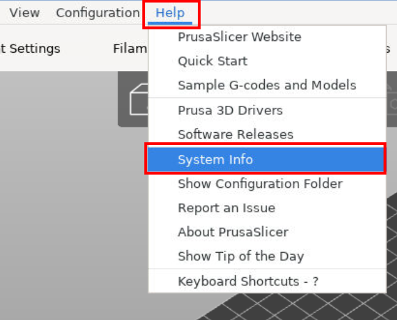
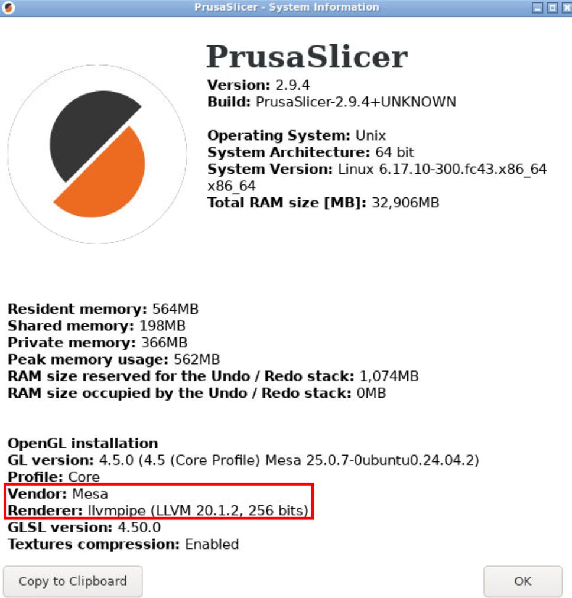
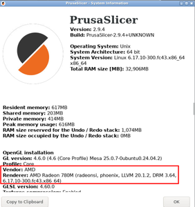
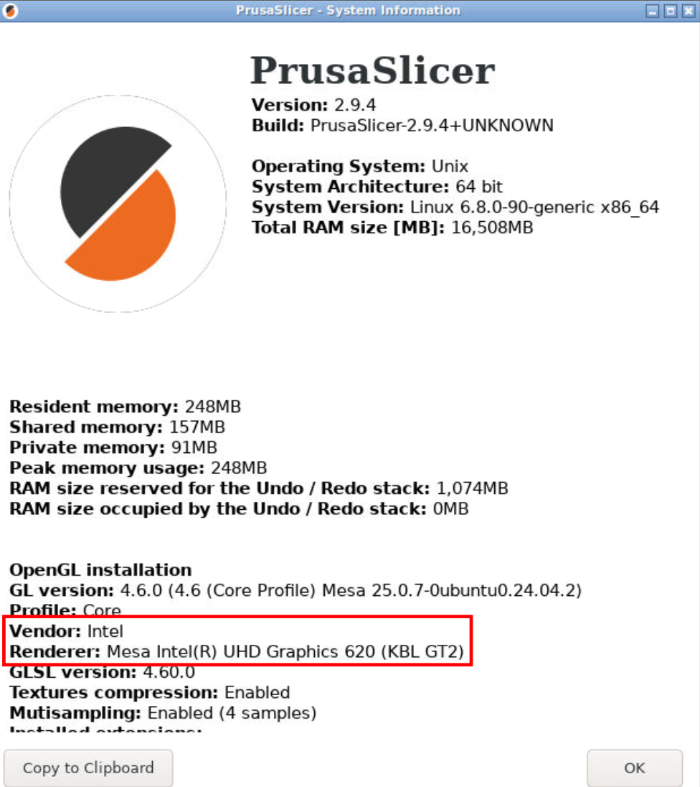
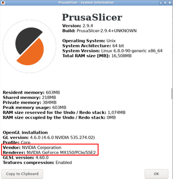

# Web-based (VNC) PrusaSlicer
[](https://hub.docker.com/r/julianneswinoga/prusaslicer-web)


## Quick start `docker-compose` examples
### No GPU acceleration

Note that without GPU acceleration, medium-to-large models will be unusable (especially the GCODE rendering).

```yaml
services:
  prusaslicer:
    image: julianneswinoga/prusaslicer-web:latest
    volumes:
      - <host config dir>:/configs
      - <host print dir>:/prints
```




### GPU passthrough with multiple GPUs (AMD/Intel acceleration only)

If you have multiple GPUs on a system (i.e. integrated Intel graphics and a dedicated GPU) the graphics acceleration in the container could get confused if everything under `/dev/dri/` is passed through. Here's a short snippet of figuring out exactly what devices should be passed through to the container. Here I want to pass through the integrated Intel graphics, but I also have an NVidia GPU in the system.

```console
$ lspci
<snip>
00:02.0 VGA compatible controller: Intel Corporation UHD Graphics 620 (rev 07)
01:00.0 3D controller: NVIDIA Corporation GP108M [GeForce MX150] (rev a1)
<snip>
```

In this case my intel GPU is on PCIe address `00:02.0`.

```console
$ ls -l /dev/dri/by-path/
lrwxrwxrwx 1 root root  8 Dec 18 22:23 pci-0000:00:02.0-card -> ../card1        # Intel GPU
lrwxrwxrwx 1 root root 13 Dec 18 22:23 pci-0000:00:02.0-render -> ../renderD128 # Intel GPU
lrwxrwxrwx 1 root root  8 Dec 18 22:23 pci-0000:01:00.0-card -> ../card0        # NVidia GPU
lrwxrwxrwx 1 root root 13 Dec 18 22:23 pci-0000:01:00.0-render -> ../renderD129 # NVidia GPU
```

`/dev/dri/by-path/pci-0000:00:02.0-*` point to `/dev/dri/card1` and `/dev/dri/renderD128`. These are the devices that I will pass through to the container.

```console
$ ls -l /dev/dri/
drwxr-xr-x 2 root root        120 Dec 18 22:23 by-path/
crw-rw---- 1 root video  226,   0 Dec 18 22:23 card0
crw-rw---- 1 root video  226,   1 Dec 18 22:23 card1
crw-rw---- 1 root render 226, 128 Dec 18 22:23 renderD128
crw-rw---- 1 root render 226, 129 Dec 18 22:23 renderD129
```

### AMD GPU acceleration
```yaml
services:
  prusaslicer:
    image: julianneswinoga/prusaslicer-web:latest
    environment:
      ENABLEHWGPU: 'true'
    devices:
      # See above note for which devices to pass through
      - /dev/dri/card1:/dev/dri/card1
      - /dev/dri/renderD128:/dev/dri/renderD128
      - /dev/kfd:/dev/kfd  # AMD also requires this device
    volumes:
      - <host config dir>:/configs
      - <host print dir>:/prints
```




### Intel GPU acceleration

(i.e. integrated Intel graphics. Not sure if this works with Intel ARC GPUs, lmk if it does or doesn't!)

We need to give the container access to the `render` group (the group that owns `/dev/dri/renderD128`), so get the group ID and add it to `group_add`:
```console
$ getent group render
render:x:993:
```

```yaml
services:
  prusaslicer:
    image: julianneswinoga/prusaslicer-web:latest
    environment:
      ENABLEHWGPU: 'true'
    devices:
      # See above note for which devices to pass through
      - /dev/dri/card1:/dev/dri/card1
      - /dev/dri/renderD128:/dev/dri/renderD128
    volumes:
      - <host config dir>:/configs
      - <host print dir>:/prints
    group_add:
      - 993  # Host `render` group
```




### NVidia GPU acceleration
- Install NVidia drivers on host
  - Ubuntu: https://documentation.ubuntu.com/server/how-to/graphics/install-nvidia-drivers/index.html
- Install `nvidia-container-toolkit`
  - Ubuntu: https://docs.nvidia.com/datacenter/cloud-native/container-toolkit/latest/install-guide.html
- Reboot after installing

```yaml
services:
  prusaslicer:
    image: julianneswinoga/prusaslicer-web:latest
    environment:
      ENABLEHWGPU: 'true'
    runtime: nvidia
    deploy:
      resources:
        reservations:
          devices:
            - driver: nvidia
              count: all
              capabilities: [gpu]
```




## Container options
The default NoVNC port is `8080`, to change it just map to a new port. For example, to access NoVNC on `8077` instead:
```yaml
services:
    prusaslicer:
      # other config
      ports:
        - '8077:8080'
```

### Common environment variables

| Name           | Default value | Explanation                                                     |
|----------------|---------------|-----------------------------------------------------------------|
| `VNC_PASSWORD` | `<empty>`     | Set a password for to access the VNC web interface.             |
| `ENABLEHWGPU`  | `<empty>`     | Set to `true` to attempt to run with hardware GPU acceleration. |

### Full environment variables

| Name            | Default value | Explanation                                                                                                                                         |
|-----------------|---------------|-----------------------------------------------------------------------------------------------------------------------------------------------------|
| `VGL_DISPLAY`   | `egl`         | Manually set the VirtualGL display device. See https://virtualgl.org/vgldoc/2_0/#GLP_Usage for more details.                                        |
| `NOVNC_PORT`    | `8080`        | Change the port that NoVNC will listen on. Note that you can also [change the port mapping in the container service definition](#container-options) |
| `SUPD_LOGLEVEL` | `TRACE`       | `supervisord` log level (i.e. the container log output).                                                                                            |

## Development

### Build the container
```shell
cd docker/
docker buildx bake
docker compose up prusaslicer-web # or prusaslicer-web-{amd,nvidia} - see docker-compose.yml
```

### Release
```shell
git tag x.y.z
git push origin x.y.z
```


----

Based off of the work from https://github.com/helfrichmichael/prusaslicer-novnc and https://github.com/helfrichmichael/prusaslicer-novnc/pull/23
